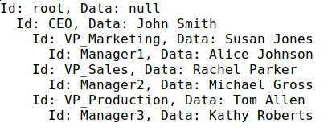

## How to use FluentSimpleTree package
### Tree creation
  * [Basic example with nodes of strings](#basic-tree-creation)
  * [Example with nodes of some user-defined type](#example-with-nodes-of-some-user-defined-type) 
  * [Tree of nodes with IDs](#tree-of-nodes-with-ids)

### Getting nodes
  * [Getting node by ID]()
  * [Getting node by predicate]()

### Deleting nodes
  * [Deleting node by ID]()
  * [Deleting node by predicate]()

### Appending nodes
  * [Basic example of how to append nodes to another]()
<hr>

## Basic tree creation
<details>
 <summary>Expand it! >></summary>
 
 

 Code:
 ```csharp
      var myTree = new Tree<string>("a");
      var root = myTree.RootNode; //a

      root
        .AddChildren(new[] { "b", "c", "d", "g" })[1] //c
          .AddChildren(new[] { "e", "f" })[0] //e
            .AddChildren(new[] { "h", "i" })[0] //h
            .Parent //e
          .NextSibling //f
            .AddChildren(new[] { "j" })[0] //j
              .AddChildren(new[] { "r", "s", "t" })[2] //t
                .AddChildren(new[] { "z", "k" });
 ```
 Output from the object myTree:

 

 [Full code here](src/SyntaxChecked.FluentSimpleTree.Consumer/SyntaxChecked.FluentSimpleTree.Consumer/TreeCreation/Example1.cs).
</details>
<hr>

## Example with nodes of some user-defined type
<details>
 <summary>Expand it! >></summary>
 
 

 Code:
 ```csharp
       var p1 = new Person("Lucas") { Age = 80 };
       var p2 = new Person("Mary") { Age = 60 };
       var p3 = new Person("Jason") { Age = 58 };
       var p4 = new Person("Peter") { Age = 55 };
       var p5 = new Person("Fred") { Age = 35 };
       var p6 = new Person("Jane") { Age = 32 };
       var p7 = new Person("Sean") { Age = 29 };
       var p8 = new Person("Jessica") { Age = 31 };
       var p9 = new Person("Hannah") { Age = 33 };
       var p10 = new Person("Joseph") { Age = 12 };
       var p11 = new Person("John") { Age = 8 };
       var p12 = new Person("Laura") { Age = 3 };

      var myTree = new Tree<Person>(p1);
      var root = myTree.RootNode; //Lucas

      root
        .AddChildren(new Person[] { p2, p3, p4 })[0] //Mary
          .AddChildren(new Person[] { p5, p6 })[0] //Fred
          .Parent //Mary
        .NextSibling //Jason
          .AddChildren(new Person[] { p7, p8, p9 })[1] //Jessica
            .AddChildren(new Person[] { p10, p11, p12 });
 ```
 Output from the object myTree:

 

 [Full code here](src/SyntaxChecked.FluentSimpleTree.Consumer/SyntaxChecked.FluentSimpleTree.Consumer/TreeCreation/Example2.cs).
</details>
<hr>

## Tree of nodes with IDs
<details>
 <summary>Expand it! >></summary>
 
 
 
 Code:
 ```csharp
       var myTree = new Tree<string>();
       var root = myTree.RootNode;

       root
         .AddChildren(new[] { ("CEO", "John Smith") })[0] //CEO
           .AddChildren(new[] { ("VP_Marketing", "Susan Jones"), ("VP_Sales", "Rachel Parker"), ("VP_Production", "Tom Allen") })[0] //VP Marketing
             .AddChildren(new[] { ("Manager1", "Alice Johnson") })[0] //Manager1
             .Parent //VP Marketing
           .NextSibling //VP Sales
             .AddChildren(new[] { ("Manager2", "Michael Gross") })[0] //Manager2
             .Parent //VP Sales
           .NextSibling //VP Production
             .AddChildren(new[] { ("Manager3", "Kathy Roberts") }); //Manager3
 ```

 Output from the object myTree:
 
 

 [Full code here](src/SyntaxChecked.FluentSimpleTree.Consumer/SyntaxChecked.FluentSimpleTree.Consumer/TreeCreation/Example3.cs).
</details>
