### 1 - Tree creation
<details>
<summary>1.1 - Basic example of Tree&lt;T> where T is string </summary>
<br>
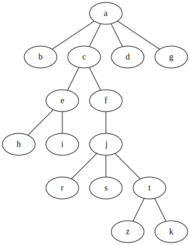

<p></p>

Code:
```csharp
    var myTree = new Tree<string>("a");
    var root = myTree.RootNode; //a

    root
      .AddChildren(new[] { "b", "c", "d", "g" })[1] //c
        .AddChildren(new[] { "e", "f" })[0] //e
          .AddChildren(new[] { "h", "i" })[0] //h
          .Parent //e
        .NextSibling //f
          .AddChildren(new[] { "j" })[0] //j
            .AddChildren(new[] { "r", "s", "t" })[2] //t
              .AddChildren(new[] { "z", "k" });
```
Output:

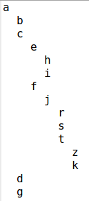

[Full code here](src/SyntaxChecked.FluentSimpleTree.Examples/SyntaxChecked.FluentSimpleTree.Examples/TreeCreation/Example1.cs).
<hr>
</details>

<details>
<summary>1.2 - Example of Tree&lt;T> where T is a user-defined type</summary>


<p></p>

Code:
```csharp
    var p1 = new Person("Lucas") { Age = 80 };
    var p2 = new Person("Mary") { Age = 60 };
    var p3 = new Person("Jason") { Age = 58 };
    var p4 = new Person("Peter") { Age = 55 };
    var p5 = new Person("Fred") { Age = 35 };
    var p6 = new Person("Jane") { Age = 32 };
    var p7 = new Person("Sean") { Age = 29 };
    var p8 = new Person("Jessica") { Age = 31 };
    var p9 = new Person("Hannah") { Age = 33 };
    var p10 = new Person("Joseph") { Age = 12 };
    var p11 = new Person("John") { Age = 8 };
    var p12 = new Person("Laura") { Age = 3 };

  var myTree = new Tree<Person>(p1);
  var root = myTree.RootNode; //Lucas

  root
    .AddChildren(new Person[] { p2, p3, p4 })[0] //Mary
      .AddChildren(new Person[] { p5, p6 })[0] //Fred
      .Parent //Mary
    .NextSibling //Jason
      .AddChildren(new Person[] { p7, p8, p9 })[1] //Jessica
        .AddChildren(new Person[] { p10, p11, p12 });
```
Output:

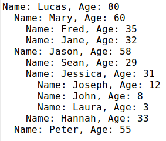

[Full code here](src/SyntaxChecked.FluentSimpleTree.Examples/SyntaxChecked.FluentSimpleTree.Examples/TreeCreation/Example2.cs).
<hr>
</details>

<details>
<summary>1.3 - Nodes with IDs</summary>
<br>
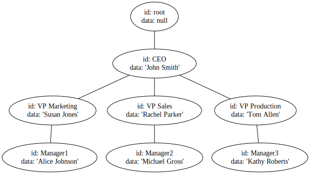

<p></p>

Code:
```csharp
    var myTree = new Tree<string>();
    var root = myTree.RootNode;

    root
      .AddChildren(new[] { ("CEO", "John Smith") })[0] //CEO
        .AddChildren(new[] { ("VP_Marketing", "Susan Jones"),
                            ("VP_Sales", "Rachel Parker"),
                            ("VP_Production", "Tom Allen") })[0] //VP Marketing
          .AddChildren(new[] { ("Manager1", "Alice Johnson") })[0] //Manager1
          .Parent //VP Marketing
        .NextSibling //VP Sales
          .AddChildren(new[] { ("Manager2", "Michael Gross") })[0] //Manager2
          .Parent //VP Sales
        .NextSibling //VP Production
          .AddChildren(new[] { ("Manager3", "Kathy Roberts") }); //Manager3
```
Output:

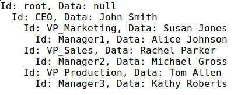

[Full code here](src/SyntaxChecked.FluentSimpleTree.Examples/SyntaxChecked.FluentSimpleTree.Examples/TreeCreation/Example3.cs).
<hr>
</details>

### 2 - Getting nodes
<details>
<summary>2.1 - By ID</summary>
<br>
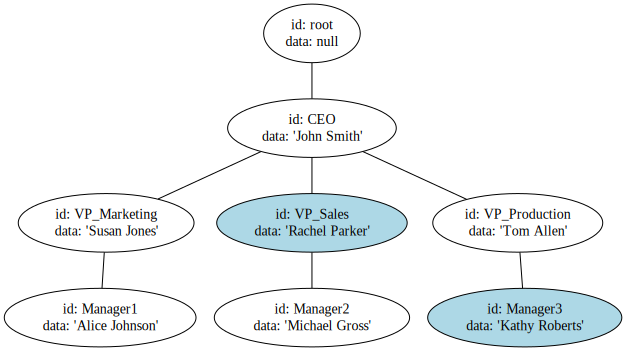

<p></p>

Code:
```csharp
    var myTree = new Tree<string>("a");
    var root = myTree.RootNode; //a

    root
      .AddChildren(new[] { ("CEO", "John Smith") })[0] //CEO
        .AddChildren(new[] { ("VP_Marketing", "Susan Jones"),
                              ("VP_Sales", "Rachel Parker"),
                              ("VP_Production", "Tom Allen") })[0] //VP Marketing
          .AddChildren(new[] { ("Manager1", "Alice Johnson") })[0] //Manager1
          .Parent //VP Marketing
        .NextSibling //VP Sales
          .AddChildren(new[] { ("Manager2", "Michael Gross") })[0] //Manager2
          .Parent //VP Sales
        .NextSibling //VP Production
          .AddChildren(new[] { ("Manager3", "Kathy Roberts") }); //Manager3

    //You can search the whole tree
    var vp_sales = myTree.GetNodeById("VP_Sales");

    //Or from a specific node
    var manager3 = root.GetDescendant("Manager3");
```
Output:

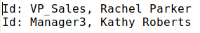

[Full code here](src/SyntaxChecked.FluentSimpleTree.Examples/SyntaxChecked.FluentSimpleTree.Examples/NodeSearching/Example4.cs).
<hr>
</details>

<details>
  <summary>2.2 - By predicate</summary>
  <details>
  <summary>2.2.1 - Tree&lt;T> where T is a value type</summary>
  <br>
  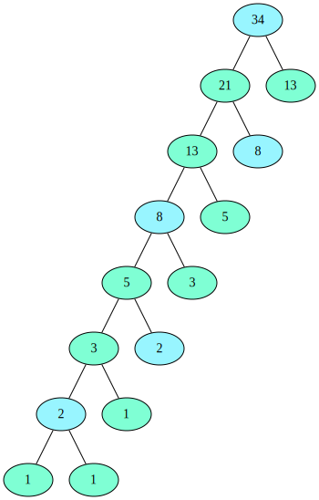

  <p></p>

  Code:
  ```csharp
        var myTree = new Tree<int>(34);
        var root = myTree.RootNode;

        root
          .AddChildren(new[] { 21, 13 })[0] //21
            .AddChildren(new[] { 13, 8 })[0] //13
              .AddChildren(new[] { 8, 5 })[0] //8
                .AddChildren(new[] { 5, 3 })[0] //5
                  .AddChildren(new[] { 3, 2 })[0] //3
                    .AddChildren(new[] { 2, 1 })[0] //2
                      .AddChildren(new[] { 1, 1 });

        var oddElements = myTree
                            .GetNodes(data => data % 2 != 0)
                            .Select(node => node.Data);

        var EvenElements = myTree
                            .GetNodes(data => data % 2 == 0)
                            .Select(node => node.Data);
  ```
  Output:

  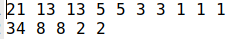

  [Full code here](src/SyntaxChecked.FluentSimpleTree.Examples/SyntaxChecked.FluentSimpleTree.Examples/NodeSearching/Example5.cs).
  <hr>
  </details>

  <details>
  <summary>2.2.2 - Tree&lt;string></summary>
  <br>
  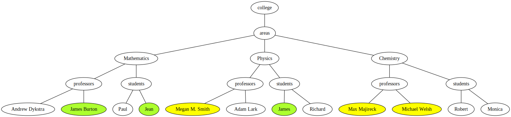

  <p></p>

  Code:
  ```csharp
        var myTree = new Tree<string>("college");

        var math = myTree.RootNode
                            .AddChildren(new[] { "areas" })[0]
                              .AddChildren(new[] { "Mathematics", "Physics", "Chemistry" })[0]; //Mathematics

        math
          .AddChildren(new[] { "professors", "students" })[0] //professors
            .AddChildren(new[] { "Andrew Dykstra", "James Burton" })[0] //Andrew Dykstra
            .Parent //professors
          .NextSibling //students
            .AddChildren(new[] { "Paul", "Jean" });

        var physics = myTree.RootNode.GetDescendants(item => item == "Physics")[0];

        physics
          .AddChildren(new[] { "professors", "students" })[0] //professors
            .AddChildren(new[] { "Megan M. Smith", "Adam Lark" })[0] //Megan M. Smith
            .Parent //professors
          .NextSibling //students
            .AddChildren(new[] { "James", "Richard" });

        var chemistry = myTree.RootNode.GetDescendants(item => item == "Chemistry")[0];

        chemistry
          .AddChildren(new[] { "professors", "students" })[0] //professors
            .AddChildren(new[] { "Max Majireck", "Michael Welsh" })[0] //
            .Parent //professors
          .NextSibling //students
            .AddChildren(new[] { "Robert", "Monica" });

        var professorsBranches = myTree.RootNode.GetDescendants(item => item == "professors");

        var namesWithPrefixM = professorsBranches
                                .SelectMany(item => item
                                                    .GetChildren(professorName => professorName
                                                                                    .StartsWith("M")));

        var areasBranches = myTree.RootNode.GetDescendants(item => item == "areas");

        var namesWithPrefixJ = areasBranches
                                .SelectMany(item => item
                                                    .GetDescendants(item => item.StartsWith("J")));
  ```
  Output:

  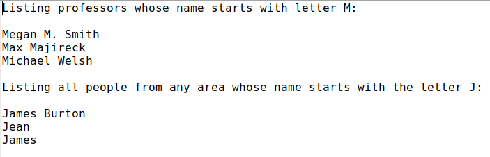

  [Full code here](src/SyntaxChecked.FluentSimpleTree.Examples/SyntaxChecked.FluentSimpleTree.Examples/NodeSearching/Example6.cs).
  <hr>
  </details>

  <details>
  <summary>2.2.3 - Tree&lt;T> where T is a reference type</summary>
  <br>
  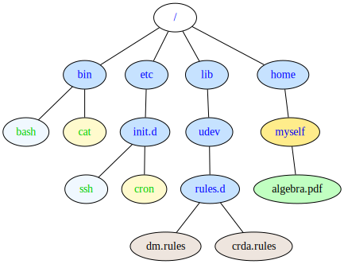

  <p></p>

  Code:
  ````csharp
      var homeDir = DirTree.RootNode.GetChildren(item => item.Name == "home")[0];

      homeDir
        .AddChildren(new[] { myDirectory })[0]
          .AddChildren(new[] { pdfDocument });

      var sysDirs = DirTree.GetNodes(item => item.Name != "/" &&
                                      item.Type == StorageUnitType.Directory &&
                                      item.Flags == "s");

      var shBinaries = DirTree.GetNodes(item => item.Name.EndsWith("sh") &&
                                        item.Type == StorageUnitType.File &&
                                        item.Flags == "x");

      var utilBinaries = DirTree.GetNodes(item => item.Type == StorageUnitType.File &&
                                          item.Flags == "x" &&
                                          (item.Name == "cat" || item.Name == "cron"));

      var configRulesFiles = DirTree.GetNodes(item => item.Type == StorageUnitType.File &&
                                          item.Flags == "d" &&
                                          item.Extension?.Contains("rules") == true);

      var userDirs = DirTree.GetNodes(item => item.Type == StorageUnitType.Directory &&
                                          item.Flags == "u");

      var userDocAlgebra = DirTree.GetNodes(item => item.Type == StorageUnitType.File &&
                                          item.Flags == "u" &&
                                          item.Extension?.Contains("pdf") == true &&
                                          item.Title?.Contains("Algebra") == true);
  ````
 Output:

  [output4.txt](src/SyntaxChecked.FluentSimpleTree.Examples/SyntaxChecked.FluentSimpleTree.Examples/NodeSearching/output4.txt)

  [Full code here](src/SyntaxChecked.FluentSimpleTree.Examples/SyntaxChecked.FluentSimpleTree.Examples/NodeSearching/Example7.cs).
  <hr>
  </details>
</details>

### 3 - Deleting nodes
<details>
 <summary>3.1 -By ID</summary>
<hr>
</details>

<details>
 <summary>3.2 -By predicate</summary>
 <hr>
</details>

### 4 - Appending nodes
Basic example of how to append a node to another one

### 5- Simulating DOM (Document Object Model)
