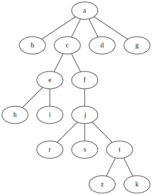
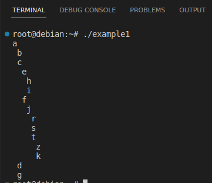
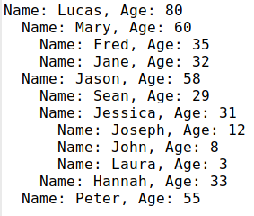

## How to use FluentSimpleTree package?
### Tree creation
  * [Basic example with nodes of strings](#basic-tree-creation)
  * [Example with nodes of some user-defined type](#example-with-nodes-of-some-user-defined-type) 
  * [Tree of nodes with ID](#tree-of-nodes-with-id)

### Searching nodes
### Deleting nodes
### Appending nodes

## Basic tree creation



```csharp
      var myTree = new Tree<string>("a");

      myTree
        .RootNode
        .AddChildren(new[] { "b", "c", "d", "g" })[1] //c
          .AddChildren(new[] { "e", "f" })[0] //e
            .AddChildren(new[] { "h", "i" })[0] //h
          .Parent //e
          .Parent //c
          .GetChild(1) //f
            .AddChildren(new[] { "j" })[0] //j
              .AddChildren(new[] { "r", "s", "t" })[2] //t
                .AddChildren(new[] { "z", "k" });
```
Output from the object myTree:



[Full code here](src/SyntaxChecked.FluentSimpleTree.Consumer/SyntaxChecked.FluentSimpleTree.Consumer/TreeCreation/Example1.cs).

## Example with nodes of some user-defined type


```csharp
      var p1 = new Person("Lucas") { Age = 80 };
      var p2 = new Person("Mary") { Age = 60 };
      var p3 = new Person("Jason") { Age = 58 };
      var p4 = new Person("Peter") { Age = 55 };
      var p5 = new Person("Fred") { Age = 35 };
      var p6 = new Person("Jane") { Age = 32 };
      var p7 = new Person("Sean") { Age = 29 };
      var p8 = new Person("Jessica") { Age = 31 };
      var p9 = new Person("Hannah") { Age = 33 };
      var p10 = new Person("Joseph") { Age = 12 };
      var p11 = new Person("John") { Age = 8 };
      var p12 = new Person("Laura") { Age = 3 };

      var myTree = new Tree<Person>(p1);

      myTree
        .RootNode
        .AddChildren(new Person[] { p2, p3, p4 })[0] //Mary
          .AddChildren(new Person[] { p5, p6 })[0] //Fred
        .Parent //Mary
        .NextSibling //Jason
          .AddChildren(new Person[] { p7, p8, p9 })[1] //Jessica
            .AddChildren(new Person[] { p10, p11, p12 });
```
Output from the object myTree:



[Full code here](src/SyntaxChecked.FluentSimpleTree.Consumer/SyntaxChecked.FluentSimpleTree.Consumer/TreeCreation/Example2.cs).

## Tree of nodes with ID
